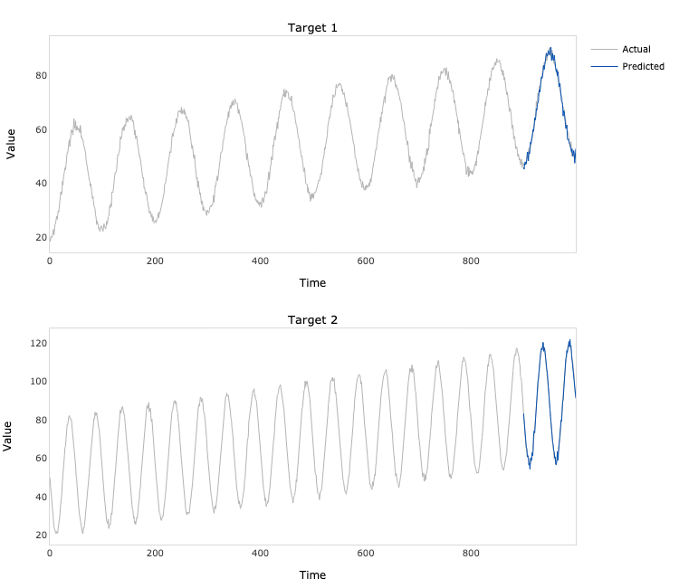
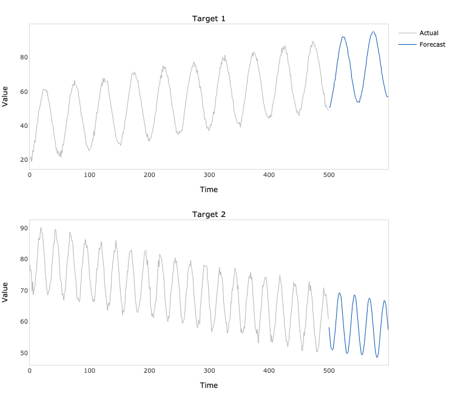

## DeepTCN TensorFlow
TensorFlow (Python) implementation of multivariate time series forecasting model introduced in Guokun Lai, Wei-Cheng Chang, 
Yiming Yang, & Hanxiao Liu. 2018. Modeling Long- and Short-Term Temporal Patterns with Deep Neural Networks. In "The 41st 
International ACM SIGIR Conference on Research & Development in Information Retrieval" (SIGIR '18). Association for Computing
Machinery, New York, NY, USA, 95–104. [https://doi.org/10.1145/3209978.3210006](https://doi.org/10.1145/3209978.3210006).

### Dependencies
```bash
pandas==1.3.4
numpy==1.19.5
tensorflow==2.7.0
plotly==5.3.1
kaleido==0.2.1
```
### Usage
```python
import numpy as np
from lstnet_tensorflow.model import LSTNet

# Generate two time series
N = 500
t = np.linspace(0, 1, N)
e = np.random.multivariate_normal(mean=[0, 0], cov=[[1, 0.25], [0.25, 1]], size=N)
a = 40 + 30 * t + 20 * np.cos(2 * np.pi * (10 * t - 0.5)) + e[:, 0]
b = 80 - 20 * t + 10 * np.sin(2 * np.pi * (20 * t - 0.5)) + e[:, 1]
y = np.hstack([a.reshape(- 1, 1), b.reshape(- 1, 1)])

# Fit the model
model = LSTNet(
    y=y,
    forecast_period=100,
    lookback_period=300,
    kernel_size=3,
    filters=4,
    gru_units=4,
    skip_gru_units=3,
    skip=50,
    lags=100,
)

model.fit(
    loss='mse',
    learning_rate=0.01,
    batch_size=64,
    epochs=50,
    verbose=1
)
```
```python
# Plot the in-sample predictions
predictions = model.predict(index=400)
fig = model.plot_predictions()
fig.write_image('predictions.png', width=750, height=650)
```

```python
# Plot the out of sample forecasts
forecasts = model.forecast()
fig = model.plot_forecasts()
fig.write_image('forecasts.png', width=750, height=650)
```


